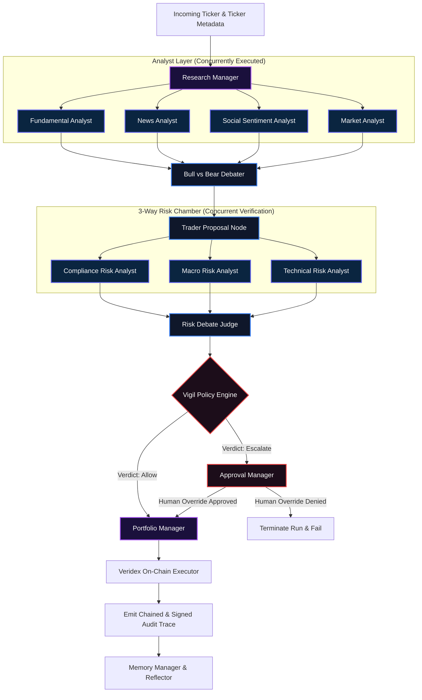

# @veridex/trading-fabric Architecture Specification

This document provides a comprehensive technical overview and architectural visualization of `@veridex/trading-fabric`. It highlights how the multi-agent trading system operates on top of the **Vigil Agent Fabric** (`@veridex/agents`) and implements secure, stateful, and audited execution loops.

---

## 1. Multi-Agent Orchestration & Flow Topology

The pipeline manages a 12-agent Directed Acyclic Graph (DAG) using the Vigil `Orchestrator` and `TaskGraph`. Unlike traditional, loosely defined agent networks, this execution DAG enforces deterministic turn transitions, state isolation, and explicit handoffs.



---

## 2. Context Compiler & Token Budget Flow

Vigil enforces an **Effective Context Window ($V_e$)** (typically 60-80% of the physical limit $V_r$) to bypass the catastrophic long-context degradation cliff (Schick, 2026). The `ContextCompiler` prioritizes inputs using an information-theoretic **Signal-to-Token Ratio** optimization algorithm.

```
                      +─────────────────────────────────────────+
                      | Physical Context Window (Vr)            |
                      | e.g. 128,000 Tokens                     |
                      +───────────────────┬─────────────────────+
                                          │
                                          ▼ Enforce Safety Ratio (0.7x)
                      +─────────────────────────────────────────+
                      | Effective Context Window (Ve)           |
                      | e.g. 89,600 Tokens (Degradation Buffer) |
                      +───────────────────┬─────────────────────+
                                          │
              ┌───────────────────────────┴───────────────────────────┐
              ▼ Deduct Static Allocations                             ▼ Allocate Dynamic Slider
+───────────────────────────+                             +───────────────────────────────────+
| System Prompt ceiling:     |                             | Remaining Available Token Budget  |
| - Agent Instructions      |                             | (Signal-to-Token Optimization)    |
| - Tool Schemas / Hashes   |                             +─────────────────┬─────────────────+
+───────────────────────────+                                               │
                                                   ┌────────────────────────┴────────────────────────┐
                                                   ▼ 40% Token Allocation                            ▼ 60% Token Allocation
                                     +───────────────────────────+                     +───────────────────────────+
                                     | Semantic Memory Blocks    |                     | Conversation History      |
                                     +─────────────┬─────────────+                     +─────────────┬─────────────+
                                                   │                                                 │
                                                   ▼ Rank by Cosine Similarity                       ▼ Compile Back-to-Front
                                     +───────────────────────────+                     +───────────────────────────+
                                     | High-density fact blocks  |                     | Chronological turns       |
                                     | selected within budget    |                     | (recency-biased layout)   |
                                     +───────────────────────────+                     +─────────────┬─────────────+
                                                                                                     │ Over Budget?
                                                                                                     ▼ Apply Turn Compression
                                                                                       +───────────────────────────+
                                                                                       | Summarize older messages  |
                                                                                       | Strip raw JSON payloads   |
                                                                                       +───────────────────────────+
```

---

## 3. Stateful Multi-Tier Memory & Self-Reconciliation Loop

Memory is managed hierarchically to isolate high-frequency noise from long-term institutional knowledge. When updates are proposed to Semantic Memory, a dedicated arbitration agent evaluates and resolves semantic contradictions.

```mermaid
sequenceDiagram
    autonumber
    participant PM as Portfolio Manager / Reflector
    participant MM as Vigil Memory Manager
    participant DB as Postgres Semantic Store
    participant Arb as LLM Arbitration Loop (Deep Provider)

    PM->>MM: proposeWrite(key: "AAPL_sentiment", fact: "AAPL sentiment is Bullish due to AI earnings", confidence: 0.9)
    MM->>DB: lookupSemantic(key: "AAPL_sentiment")
    DB-->>MM: return ExistingFact(fact: "AAPL sentiment is Bearish due to antitrust lawsuit", confidence: 0.8)
    
    rect rgb(20, 20, 30)
        note right of MM: Contradiction Detected! (Antitrust Bearish vs. AI Earnings Bullish)
        MM->>Arb: triggerReconciliation(ExistingFact, ProposedFact)
        Arb->>Arb: Aggregate timeline, confidence ratings, and provenance trails
        Arb-->>MM: return ResolvedFact(fact: "AAPL sentiment is Mixed: antitrust headwinds balanced by strong AI growth", confidence: 0.85, mergedProvenance: [tx_1, tx_2])
    end
    
    MM->>DB: saveSemantic(ResolvedFact, version++)
    DB-->>MM: Transaction Committed
    MM-->>PM: Memory Written & Consolidated
```



---

## 4. Declarative Policy, Approvals, & PostgreSQL JSONB Checkpoints

All consequential trade actions must clear the `PolicyEngine`. If a policy rule triggers an `escalate` verdict, the active run is checkpointed into a standard PostgreSQL `JSONB` table structure and suspended pending human action.

```
+─────────────────────+
|  Portfolio Manager  |
+──────────┬──────────+
           │
           │ 1. Proposes BUY $15,000 SOL (Position limit is $10,000)
           ▼
+─────────────────────+
| Vigil Policy Engine |
+──────────┬──────────+
           │
           ├─► Rule Check: Position Limit Breached! 
           │
           ▼ Verdict: Escalate
+─────────────────────+
|  Approval Manager   |
+──────────┬──────────+
           │
           ├─► 2. Serializes state & history to Checkpoint Schema
           │   
           ▼ Write Checkpoint Transaction
+───────────────────────────────────────────────────────────+
|               PostgreSQL Checkpoint Storage               |
|                                                           |
|  TABLE: trading_fabric_checkpoints                       |
|  - id: VARCHAR (PK)                                       |
|  - run_id: VARCHAR                                        |
|  - active_node: VARCHAR ("portfolioManager")              |
|  - current_turn_index: INT                                |
|  - state_snapshot: JSONB  <-- Full variables serialized   |
|  - memory_diffs: JSONB                                    |
|  - serialized_history: TEXT                               |
|  - pending_proposal: JSONB <-- BUY $15,000 SOL parameters  |
|  - event_log_offset: INT                                  |
+───────────────────────────┬───────────────────────────────+
                            │
                            ├─► 3. Emits "approval_requested" event ──► Render on TUI / Slack
                            │
                            ▼ 4. Human Decision: "approve"
+───────────────────────────────────────────────────────────+
|                 Checkpoint Resumption                     |
+───────────────────────────┬───────────────────────────────+
                            │
                            ├─► 5. Loads state_snapshot & serialized_history
                            ├─► 6. Removes record from DB (Optimistic Lock)
                            │
                            ▼ Resumes Run Loop
+─────────────────────+
| On-Chain Execution  |
+─────────────────────+
```

---

## 5. Cryptographic On-Chain Session-Key Execution Path

When execution is enabled, `VeridexExecutionProvider` constructs, signs, and executes the USDC transfer on Base Sepolia using short-lived session keys. All metadata and signatures are permanently cataloged on an immutable audit ledger.

```mermaid
sequenceDiagram
    autonumber
    participant Agent as Portfolio Manager Run Loop
    participant Exec as VeridexExecutionProvider
    participant SM as SessionManager (Veridex SDK)
    participant Relayer as Base Sepolia Relayer Mesh
    participant EB as EventBus (Tamper-evident Traces)

    Agent->>Exec: execute(action: "Buy", amountUsd: 25)
    
    rect rgb(20, 20, 30)
        note over Exec, SM: Session Key Handshake (ADR #1 Configured Limits)
        Exec->>SM: getActiveSession()
        SM-->>Exec: null (No active session)
        Exec->>SM: createSession(duration: 86400, maxValue: 50000000n)
        SM-->>Exec: return SessionKeyInfo(userKeyHash, expiresAt, maxValue)
    end

    Exec->>Exec: usdToBaseUnits($25, 6 decimals) -> 25_000_000n
    Exec->>SM: buildTransferPayload(to: paper_vault, amount: 25_000_000n)
    SM-->>Exec: return rawPayloadHex
    
    Exec->>SM: signAction(sessionAction)
    SM-->>Exec: return SessionSignedAction(signature, readyToSubmit)

    Exec->>Relayer: submitSignedAction(payload, nonce, signature)
    Relayer-->>Exec: return RelayerResult(success: true, txHash: "0xef...32a")

    Exec->>EB: emit(type: "execution_result", txHash: "0xef...32a", status: "success")
    note over EB: Hashes stringified event + previous envelope signature<br/>producing tamper-proof signed audit block.
    
    Exec-->>Agent: return ExecutionEnvelope(surface: "testnet", status: "filled", txHash)
```


